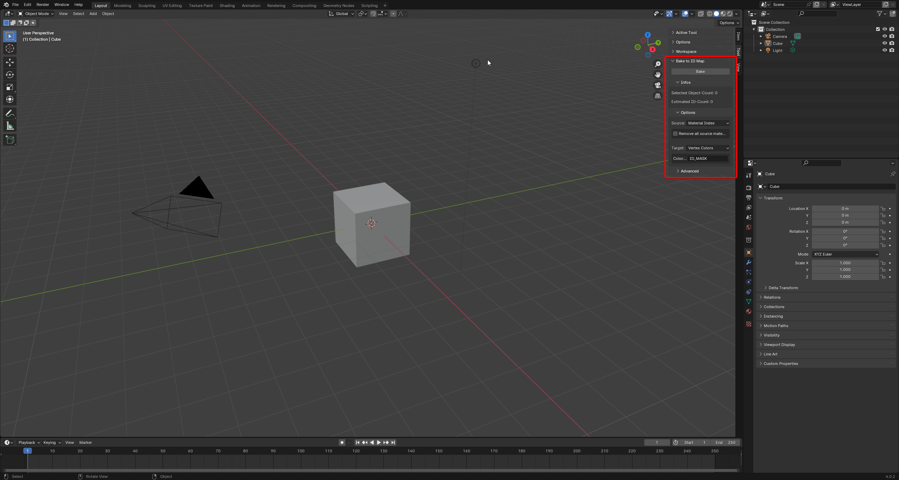

# Blender - Bake ID Mask Plugin

A plugin to quickly bake ID masks for meshes from/to different sources and targets.

### Currently supported:
Sources:
- Material Index

Targets:
- Vertex Color

## Installation
1. Download the newest file from the releases tab.
2. Go to your blender preferences
3. In Add-Ons, click on the "Install..." button and navigate to the downloaded file.
4. After selecting it, just enable it and done.

## Usage
You find the tool in the panel on the right of the "3D Viewport" under "Tool".

How to use properly it, highly depends on the selected source.

### Usage - Material Index Source
Here the IDs are given based on the object and its material indices.

Lets say, you have 10 objects and each has 2 materials attached to it. Then the amount of IDs given is 20, since each object contains the two material indecies.
