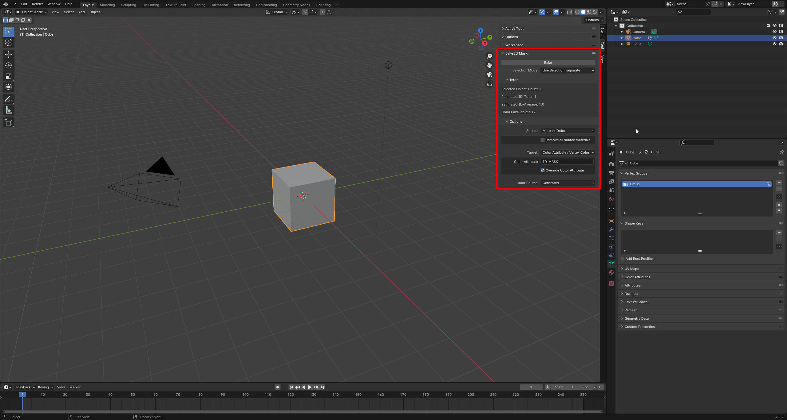
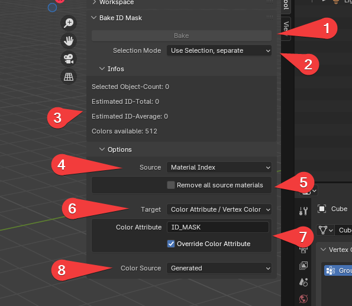

# Bake ID Mask
This tool allows you to quickly create a ID mask based on different sources

The tool is found in the Tool category in the Side Panel of the 3D View.

## The UI

1. The Bake button. Click on it to bake, after you have setup your selection
2. Selection Mode. See "Parameters"
3. This panel gives you infos about how many ID you gonna bake and how many colors you have in your color source
4. The source specifies, what kind of dataset the system will take to calculate its IDs
5. This box allows the source to have parameters, you can change
6. The target specifies, where the ID get drawn to. Currently only color attributes are supported
7. as with the source, the target can have parameters, as well.
8. This allows you to change the color source, from where the system takes the colors.

## Parameters
### Selection Mode
The "Selection Mode" has 3 different options:
1. Only active element - The bake will only apply to the actively selected object. If no active object was found, nothing will happens.
2. Use Selection, separate - The bake will apply to all selected objects, but each object will be processed individually by the source. 
Example: With Material Index, the ID will always correspond with the Material Index, ignoring what ever happens with the other objects.
3. Use Selection, combined - The bake will apply to all selected object and will be processed together by the source.
Example: With Material Index, it will count up every Material Index it finds.

### Sources
#### Material Index
This source will give away IDs based on the material index, a face uses. 
This can be useful, when you use multiple materials in one mesh and want to export it with only one material and without loosing the info, which face had different materials.

The "Remove all source materials" option will, if checked, remove all material indecies from the mesh, allowing you to directly export it to your application.

#### Object ID
This source will only work properly in "Use Selection, combined" - Selection Mode. The source works by giving every selected Object an incrementing ID.

### Targets
#### Color Attribute / Vertex Color
This target will save the ID-color onto the color attribute specified.

By default, it will remove the old color attribute completely and replace it, if one already exists with the name. This can be prevent by unchecking "Override Color Attribute".
The ID-color will then just painted on top of the existing attribute, overriding existing colors, if there were any.

### Color Sources
#### Generated
This color source will generate a list of colors to use, which get increasingly less saturated and bright as further, you approach the limit.

#### Color Palette
This allows you to specify an own palette, previously created in Blender. 

Due to the way palettes work in Blender, you can **not** create or edit the palette here. You can create one in one of the "Paint" modes, like Vertex Paint.