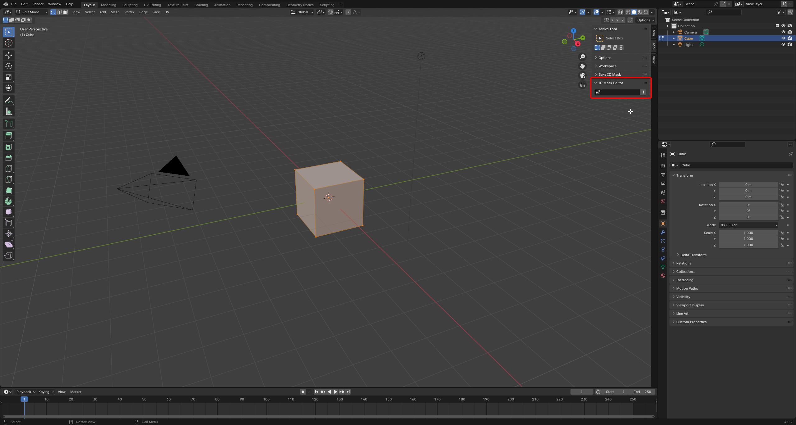
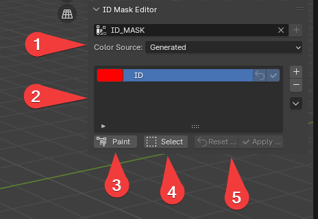
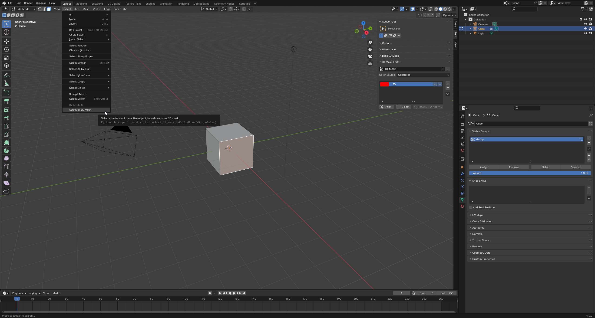

# ID Mask Editor
The "ID Mask Editor" allows you to quickly add IDs to faces in a mesh.

## Getting started
The editor is found in the Tool category in the Side Panel of the 3D View. The editor is only visible when you are in Edit Mode.

By default, its pretty empty. That is because you need to specify a color attribute, you want to paint your ID-mask to.
You can either select an already existing color attribute or you create a new one using the "Plus"-button. That will automatically create color attribute called "ID_MASK" and set it as ID-mask.

With the attribute selected, you will see a few more options.

## The UI

1. The color source. That specifies how the initial colors are generated, when adding new IDs using the "Plus"-Button
2. This is the ID-list. It works similarly to the Vertex Groups-list. The only big difference is how the items works. You can change the color and name of an ID. Change the color will cause the two buttons to be enabled. They allow you to either "Revert" the change you made or to "Apply" it, which will change the ID-mask to reflect the change.
3. Clicking the "Paint"-button will paint the currently active ID (indicated by the blue background in the list) onto the currently selected **faces**.
4. Clicking the "Select"-button will select every face currently using the currently active ID (indicated by the blue background in the list)
5. Changing the color on a ID will not automatically apply it onto the attribute. This will allow you to apply/revert all those changes, with one click.

### Additional Features
Using the arrow next to the list allows you to find additional features:
- Find used colors: Using this feature will automatically detect colors found in the attribute, but not found in the ID list, and add them. 
Very useful when dealing with a mesh created without this tool or if you accidentally removed an ID from the list.

## One additional thing
While not directly related to the ID-Mask, but still kinda, there is a new selection found under the "Select" menu.
This will allow you to quickly select faces, with the same ID, then the face you have currently active.

